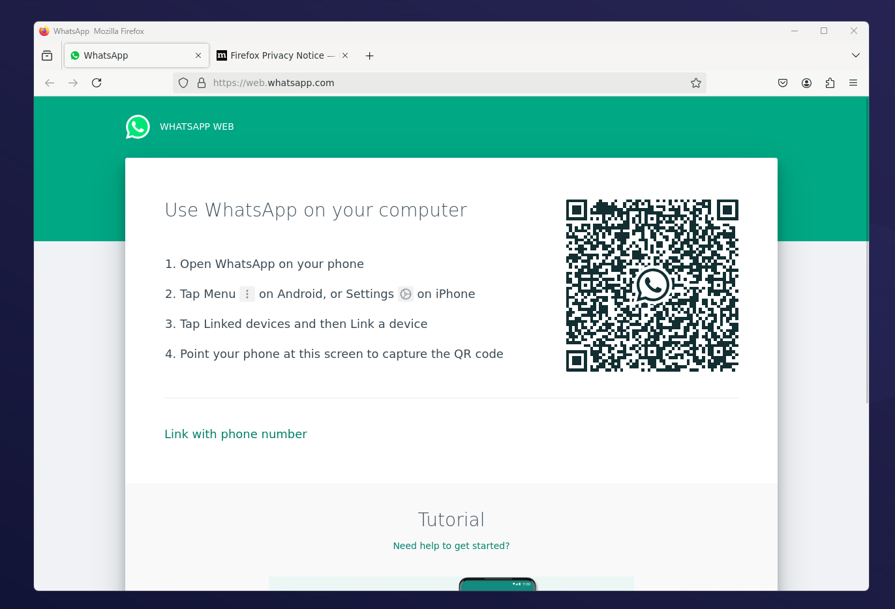

# Docker WhatsApp Firefox

This repository contains a Docker configuration to run WhatsApp Web using Firefox with support of GUI, text copy+paste and Hebrew language.

It uses Xvfb to create a virtual framebuffer and X11 forwarding to display the GUI on the host machine.



## Prerequisites

- Docker
- Xming or any other X11 server (for Windows)

## Getting Started

1. **Build the Docker Image**:

   ```sh
   docker build -t whatsapp-firefox-docker .
   ```

2. **Start Xming**:
   - Download and install Xming from the [official website](https://sourceforge.net/projects/xming/).
   - Ensure the Xming icon appears in the system tray (near the clock).

3. **Run the Docker Container**:

   ```sh
   
   docker run -it -e DISPLAY=host.docker.internal:0 -v "C:\Users\YOUR_USERNAME\Downloads":/home/user/pdfs -v "C:\Users\YOUR_USERNAME\firefox-profile":/home/user/.mozilla/firefox whatsapp-pdf-docker
   ```

   Replace `YOUR_USERNAME` with your actual Windows username.

## Files

- `Dockerfile`: Contains the instructions to build the Docker image.

## License

This project is licensed under the MIT License - see the [LICENSE](LICENSE) file for details.

### Ubuntu Base Image

This project uses the `ubuntu:20.04` Docker image as its base. Ubuntu is a registered trademark of Canonical Ltd. Ubuntu and its components are distributed under various open-source licenses, primarily the GNU General Public License (GPL). For more information, please see the [Ubuntu License Information](https://ubuntu.com/licensing) and [Canonical's Intellectual Property Rights Policy](https://ubuntu.com/legal/intellectual-property-policy).

